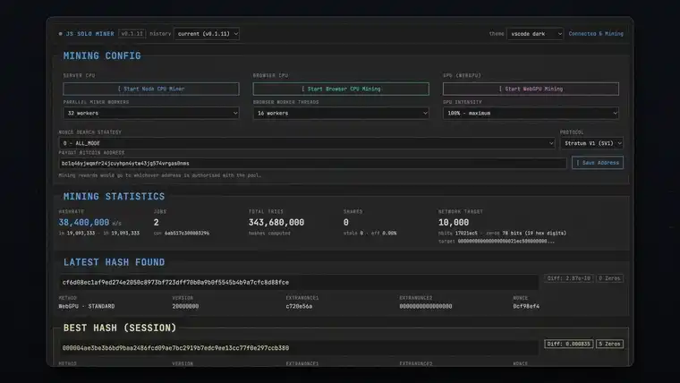

<div align="center">

# Bitcoin JS Solo Miner

**A real Stratum V1 solo miner in TypeScript — with a terminal-style dashboard that shows you every step.**

Mine on the server's CPU, in the browser on Web Workers, or on the GPU via WebGPU.

[](LICENSE)
[](https://nodejs.org)
[](https://www.typescriptlang.org/)
[](https://github.com/SeyyedKhandon/bitcoin-js-solo-miner/releases)
[](https://github.com/SeyyedKhandon/bitcoin-js-solo-miner/stargazers)



**[▶ Watch the full 2K demo (64s)](https://www.youtube.com/watch?v=3ISmhv0v9Fc)**

</div>

---

## What it is

It implements the full `subscribe → authorize → job → hash → submit` loop that real ASIC miners use, against a live pool. Nothing is simulated: it builds a real Merkle root, assembles a real 80-byte block header, and can submit genuine shares.

The dashboard exposes every step — live hashrate, share and network difficulty, and the block header decoded out of each job's coinbase transaction.

## Quick start

```bash
git clone https://github.com/SeyyedKhandon/bitcoin-js-solo-miner.git
cd bitcoin-js-solo-miner
npm install
npm start
```

Open **http://localhost:8080**. Server CPU mining starts automatically.

Requires **Node.js 23.6+** — types are stripped natively, so the backend runs straight from source with no build step.

## Three ways to mine

| | Runs on | Throughput\* |
| :-- | :-- | --: |
| **Server CPU** | Node `worker_threads`, up to 32 | ~740 kH/s per worker |
| **Browser CPU** | Web Workers, synchronous SHA-256 | ~890 kH/s per worker |
| **GPU** | WebGPU compute shader | ~82 MH/s |

<sub>\*Measured on one development machine — yours will differ.</sub>

All three build a real header and can find real shares. GPU intensity (25 / 50 / 75 / 100%) is a genuine duty cycle: the miner times each batch and idles for the remainder, so throttling really does leave the card free.

## Features

- **Live dashboard** — hashrate, shares, network target, best hash, decoded block header
- **Performance history** — hashrate chart and a per-strategy scoreboard, kept in your browser
- **12 nonce-search strategies** — `ALL_MODE` rotates through them so you can compare
- **5 themes** — matrix, vscode dark, amber, ice, paper
- **Version history** — browse the dashboard as it looked at any earlier release
- **Your own payout address** — set it from the UI; the miner re-authorises with the pool

## Is it correct?

Mining code fails silently — a byte-order mistake just means hashing garbage forever. So the header, Merkle and target logic are checked against external ground truth:

- **The real genesis block.** Block 0's header and coinbase, pulled from a public explorer and run through this project's Merkle-root and header assembly, reproduce `000000000019d668…0a8ce26f` exactly.
- **ckpool's own validator.** `share_diff()` — the C function the real pool uses to verify submissions — was ported and fed the exact fields this miner submits. It reconstructs an identical hash, so a share found here would validate at the pool.
- **The SHA-256** matches Node's `crypto` across random inputs, and the browser workers' hashes re-derive exactly under the verified implementation using live pool jobs.

## How Stratum mining works

1. **Subscribe** — open a TCP socket, send `mining.subscribe`; the pool returns `extranonce1` and an `extranonce2` size.
2. **Authorize** — send `mining.authorize` (on solo pools a Bitcoin address is the username).
3. **Receive jobs** — the pool pushes `mining.notify`: previous block hash, coinbase halves, Merkle branch, version, bits, time.
4. **Mine** — assemble the coinbase, double-SHA256 it, fold it through the Merkle branch, build the 80-byte header, and hash it with an incrementing nonce until the result is below the target.
5. **Submit** — send the winning nonce back with `mining.submit`.

The Block Header panel decodes that same coinbase for real — height, miner tag, outputs, BIP-54/BIP-110 signalling — ported from ESP-Miner's `coinbase_decoder.c`.

> **Note on strategies:** every nonce is equally likely to win. The twelve search orders are an experiment, not an edge. Two of them (`INVERTED_VERSION`, `RANDOM_INVERTED`) are deprecated — they alter the header version without negotiating BIP320 version-rolling, so the pool rejects any share found under them.

## Configuration

Defaults live in `config.ts`. Pool, worker count, strategy, GPU intensity and payout address can all be changed live from the dashboard and are remembered in your browser.

```bash
npm run build       # compile the dashboard's TypeScript
npm run typecheck   # type-check everything, emitting nothing
npm run snapshot    # snapshot the built dashboard into releases/<version>/
```

## Project layout

```
index.ts / config.ts        entry point and settings

lib/        hash.ts (double-SHA256, Merkle, target math), bitcoin-address.ts,
            changelog.ts, types.ts, logger.ts, format.ts

mining/     stratum-client.ts   Stratum V1 TCP client
            miner.ts            coordinates workers, tracks stats
            worker.ts           per-thread hashing loop
            strategies.ts       nonce-search strategies
            coinbase-decoder.ts decodes block info from a job's coinbase

server/     http-server.ts      dashboard, REST API, SSE stats, release history
            ws-server.ts        WebSocket endpoint for browser/GPU miners

public/     index.html, style.css, app.ts, history.ts
            sha256.ts           synchronous SHA-256 (80-byte header fast path)
            browser-miner.ts    Web Worker pool coordinator
            browser-worker.ts   one browser mining thread
            webgpu-miner.ts, shader.ts   GPU miner and WGSL compute shader
```

## Deployment

This is a **persistent process** — it holds a TCP connection to the pool, runs worker threads, and serves a WebSocket. Static hosts (GitHub Pages, Netlify) cannot run it, because the Stratum connection is a raw TCP socket a browser cannot open; the server exists precisely to proxy it.

`render.yaml` is included for [Render](https://render.com). Its free tier sleeps after 15 minutes, so either keep it warm with an uptime pinger (750 free instance-hours/month covers one always-on service) or use a host that does not sleep, such as an Oracle Cloud Always Free VM.

## Reality check

Solo mining at these hashrates will not find a block. A GPU at ~80 MH/s against a network around 10²¹ H/s works out to roughly one block every few hundred million years.

This is a tool for understanding how Bitcoin mining actually works — and for the very small chance that makes solo mining fun. It is not an income source.

## Star history

[](https://star-history.com/#SeyyedKhandon/bitcoin-js-solo-miner&Date)

## Support

If this was useful:

```
bc1q46yjwqmfr24jcuyhpn4ytw43jg574vrgas0nms
```

## Authors

**SeyyedKhandon** — author and maintainer · [github.com/SeyyedKhandon](https://github.com/SeyyedKhandon)

Portions were written with Claude (Anthropic), credited as co-author in the commit history. The coinbase decoder is a port of ESP-Miner's `coinbase_decoder.c`; share validation is verified against ckpool's `share_diff()`.

Issues and pull requests welcome.

## License

[MIT](LICENSE) © 2026 SeyyedKhandon
